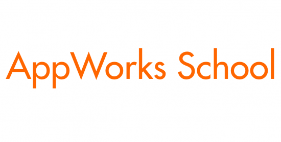

<h1 align="center">區塊鏈自學資源彙整</h1>

  

這是一份由 AppWorks School 整理的 Solidity 區塊鏈開發自學教材，目的在降低區塊鏈知識學習門檻，讓更多人能夠接觸區塊鏈技術。透過階段式實作的方式，逐步學習區塊鏈相關知識，並統整線上的學習資源，以解決目前區塊鏈領域自學時資源散落不易搜集的問題。

開放式資源將會持續更新，歡迎各路好手提供建議和指正，讓這份資源更完整！

--- 

# 目錄
教材主要分成三個部分：

<table>
  <tr>
    <td style="white-space: nowrap">
      <a href="./section1/README.md">區塊鏈基礎知識</a>
    </td>
    <td>
      根據線上已有的學習資源，了解基本的區塊鏈及以太坊相關概念（合約、Solidity 語法、交易、錢包、節點等）
    </td>
  </tr>
  <tr>
    <td style="white-space: nowrap">
      <a href="./section2/README.md">上手實作及問題思考</a>
    </td>
    <td>透過實戰演練及特定主題研究，對區塊鏈有更深一層的了解。</td>
  </tr>
  <tr>
    <td style="white-space: nowrap">
      <a href="./section3/README.md">經典 DeFi 機制的賞析</a>
    </td>
    <td>
      了解經典的 DeFi 基礎建設，並能夠複製、整合、加以改進，由學習層面進階到實際應用層面
    </td>
  </tr>
</table>
